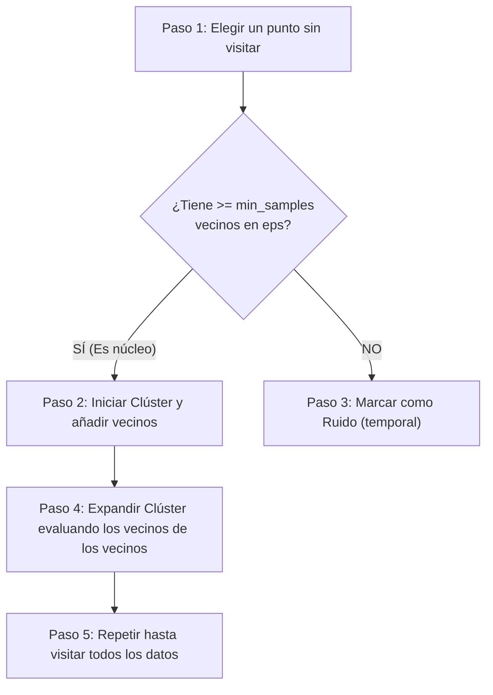

# 🛸 Explicación Didáctica: Algoritmo DBSCAN

Esta guía detallada te permitirá explicar a tus compañeros cómo funciona **DBSCAN** (Density-Based Spatial Clustering of Applications with Noise), el algoritmo basado en **densidad** de nuestro proyecto.

---

## 💡 1. ¿Qué es DBSCAN de manera intuitiva?

Imagina que estás viendo fotos satelitales de la Tierra de noche:
*   Las grandes concentraciones de luces representan las ciudades (zonas de **alta densidad** de personas).
*   La oscuridad total entre ciudades representa el campo, desiertos u océanos (zonas de **baja densidad**).

**DBSCAN** busca agrupamientos de esa misma manera:
1.  Encuentra zonas densamente pobladas de datos y las agrupa en clústeres.
2.  Aquellos datos aislados que quedan en zonas oscuras y despobladas no son forzados a entrar a ningún grupo; el algoritmo los etiqueta directamente como **ruido o anomalías (outliers)**.

> **¡Diferencia clave con K-Means!** 
> En K-Means debes definir cuántos grupos ($K$) quieres desde el inicio. En DBSCAN **no necesitas definir el número de grupos**; él los descubre por sí mismo basándose en la cercanía y densidad de los datos.

---

## 📍 2. Los dos hiperparámetros fundamentales

Para que el "radar" de DBSCAN funcione, el usuario debe ajustar únicamente dos perillas:

1.  **Epsilon ($\epsilon$ o `eps`)**: Es la distancia máxima (el radio del radar) que dibuja un círculo alrededor de un punto para buscar a sus vecinos.
2.  **Muestras Mínimas (`min_samples`)**: La cantidad mínima de datos que deben encontrarse dentro del círculo de radio `eps` (incluyendo al propio punto) para considerar que esa zona es "densa".

---

## ⭕ 3. Clasificación de los Puntos

DBSCAN clasifica cada dato del dataset en una de estas tres categorías:

*   **Puntos Núcleo (Core Points)**: Tienen al menos la cantidad de vecinos definida en `min_samples` dentro de su radio `eps`. Son el corazón de un grupo (el centro de la ciudad).
*   **Puntos Frontera (Border Points)**: Tienen menos vecinos que `min_samples`, pero están dentro del radio de algún Punto Núcleo. Son los suburbios o límites del clúster.
*   **Puntos de Ruido (Noise)**: No son Puntos Núcleo y tampoco tienen a ningún Punto Núcleo cerca dentro de su radio `eps`. Son los datos atípicos o anomalías.

---

## 🔄 4. Flujo Paso a Paso de DBSCAN



1.  **Exploración**: Selecciona un punto al azar que no haya sido visitado y analiza su vecindario dibujando un círculo de tamaño `eps`.
2.  **Detección de Núcleo**:
    *   Si el círculo contiene al menos `min_samples`, se crea un **nuevo clúster** y este punto se convierte en un Punto Núcleo.
    *   Si no contiene suficientes puntos, se le marca temporalmente como **ruido** (puede cambiar a Punto Frontera si más adelante se le asocia a otro grupo).
3.  **Expansión**: Para todos los puntos vecinos agregados al clúster, el algoritmo repite el análisis de vecindad. Si un vecino también resulta ser un Punto Núcleo, su propio círculo de vecinos se anexa al grupo, haciendo que el clúster crezca dinámicamente.
4.  **Finalización**: El algoritmo se detiene cuando ha evaluado y visitado cada uno de los puntos en el dataset.

---

## ⚖️ 5. Ventajas y Desventajas (Para debatir en clase)

### Ventajas:
*   **No requiere definir $K$**: Excelente cuando no conocemos de antemano cuántos perfiles existen.
*   **Formas arbitrarias**: K-Means solo detecta grupos esféricos o circulares. DBSCAN puede detectar grupos con formas complejas u alargadas (como constelaciones en forma de líneas o anillos).
*   **Manejo de Outliers**: Filtra y limpia el ruido de forma nativa.

### Desventajas:
*   **Densidades variables**: Si en el dataset hay grupos muy concentrados y otros muy dispersos, es difícil encontrar un único valor de `eps` que funcione para todos.
*   **Alta dimensionalidad**: En espacios con demasiadas columnas, calcular distancias se vuelve ineficiente y pierde precisión (Maldición de la Dimensionalidad).

---

## 💻 6. Implementación en Código

En nuestro pipeline, DBSCAN se entrena y se obtienen los puntos clasificados como ruido de la siguiente manera:

```python
from sklearn.cluster import DBSCAN
from sklearn.metrics import silhouette_score
import numpy as np

def entrenar_dbscan(df_features, eps=1.5, min_samples=5):
    X = df_features.values
    
    # 1. Instanciar el modelo con los hiperparámetros
    model = DBSCAN(eps=eps, min_samples=min_samples)
    
    # 2. Ajustar y predecir los clústeres
    labels = model.fit_predict(X)
    
    # 3. Calcular puntos de ruido (DBSCAN les asigna la etiqueta -1)
    puntos_ruido = int(np.sum(labels == -1))
    
    # 4. Calcular Silhouette Score (excluyendo el ruido)
    mask = labels != -1
    if len(set(labels[mask])) > 1:
        silueta = float(silhouette_score(X[mask], labels[mask]))
    else:
        silueta = 0.0
        
    return model, labels, puntos_ruido, silueta
```
