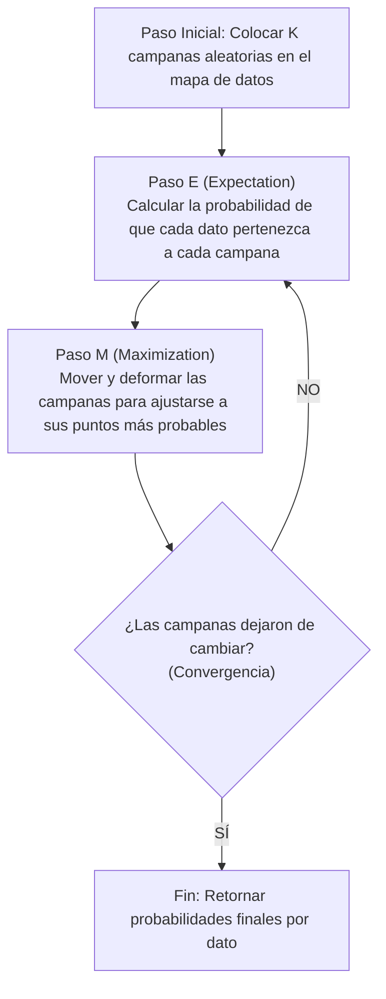

# 📊 Explicación Didáctica: Gaussian Mixture Models (GMM)

Esta guía te permitirá explicar de forma clara y profesional el funcionamiento de **GMM** (Modelos de Mezcla Gaussiana), el algoritmo probabilístico y de clustering suave en nuestro pipeline.

---

## 💡 1. ¿Qué es GMM de manera intuitiva?

Imagina que estás clasificando personas según su personalidad astrológica en dos grupos: "Intelectuales (Aire)" y "Emocionales (Agua)".
*   **K-Means (Clustering Rígido / Hard Clustering)** obligaría a que una persona pertenezca estrictamente al 100% a un único grupo, eliminando cualquier punto medio.
*   **GMM (Clustering Suave / Soft Clustering)** es más realista: calcula la **probabilidad matemática** de que una persona pertenezca a cada grupo. Por ejemplo: un usuario puede ser $85\%$ del grupo Aire y $15\%$ del grupo Agua.

GMM asume que los datos de cada clúster siguen una distribución de probabilidad en forma de **Campana de Gauss** (también llamada distribución normal). El algoritmo intenta encontrar la posición, tamaño y dirección de estas campanas para que cubran de la mejor manera posible a los datos.

---

## 📍 2. Los Componentes de una Campana de Gauss en GMM

Para cada grupo (o componente Gaussiano), el algoritmo calcula tres cosas:

1.  **La Media ($\mu$)**: Es el centro de la campana (el equivalente al centroide en K-Means).
2.  **La Covarianza ($\Sigma$)**: Define el ancho y la orientación de la campana. A diferencia de K-Means (que asume que todos los grupos son esferas perfectas de igual tamaño), GMM permite que los grupos sean elipses alargadas en cualquier dirección.
3.  **El Peso de la Mezcla ($\pi$)**: Qué tan grande o abundante es ese grupo en comparación con los demás dentro de la población total.

---

## 🔄 3. El Algoritmo Expectation-Maximization (EM)

GMM entrena utilizando una técnica llamada **Expectation-Maximization (EM)**, que optimiza las campanas a través de dos pasos que se repiten en bucle:



### 🧠 Paso E (Expectativa - Calcular Responsabilidades)
*   Para cada dato del dataset, el algoritmo calcula la probabilidad (o "responsabilidad") de que haya sido generado por cada una de las $K$ campanas Gaussianas.
*   *Resultado*: Si un punto está en medio de dos campanas, recibirá una asignación compartida (ej. 50% clúster A y 50% clúster B).

### 📈 Paso M (Maximización - Actualizar Parámetros)
*   El algoritmo toma las campanas de Gauss y las rediseña basándose en los puntos que le fueron asignados.
*   La campana se moverá hacia donde están sus puntos más probables (actualiza la media $\mu$) y cambiará su tamaño y rotación para envolverlos de forma óptima (actualiza la covarianza $\Sigma$).

---

## 📉 4. Criterios de Selección: AIC y BIC

¿Cómo sabemos cuál es el número ideal de campanas si no lo conocemos de antemano? En GMM evaluamos dos métricas matemáticas basadas en la teoría de la información:

1.  **BIC (Bayesian Information Criterion)**
2.  **AIC (Akaike Information Criterion)**

Ambas métricas evalúan qué tan bien se adaptan las campanas a los datos, pero **penalizan severamente al modelo si agregamos demasiadas campanas** (para evitar el sobreajuste o *overfitting*). 
*   **Regla**: El número óptimo de componentes se encuentra en el punto donde los valores de **AIC y BIC son mínimos**.

---

## 💻 5. Implementación en Código

En el backend de nuestro proyecto, GMM se entrena y evalúa recolectando tanto las asignaciones rígidas finales como las matrices de probabilidad:

```python
from sklearn.mixture import GaussianMixture
from sklearn.metrics import silhouette_score

def entrenar_gmm(df_features, n_components=4):
    X = df_features.values
    
    # 1. Instanciar el modelo GMM
    model = GaussianMixture(n_components=n_components, random_state=42)
    
    # 2. Ajustar el modelo usando el algoritmo EM
    model.fit(X)
    
    # 3. Predecir etiquetas duras (clúster con probabilidad más alta)
    labels = model.predict(X)
    
    # 4. Obtener las probabilidades de pertenencia suave
    # Retorna una matriz donde cada fila tiene K columnas (una probabilidad por grupo)
    probabilidades = model.predict_proba(X)
    
    # 5. Calcular métricas
    metrics = {
        "BIC": float(model.bic(X)),
        "AIC": float(model.aic(X)),
        "Silhouette Score": float(silhouette_score(X, labels))
    }
    
    return model, labels, metrics, probabilidades
```
