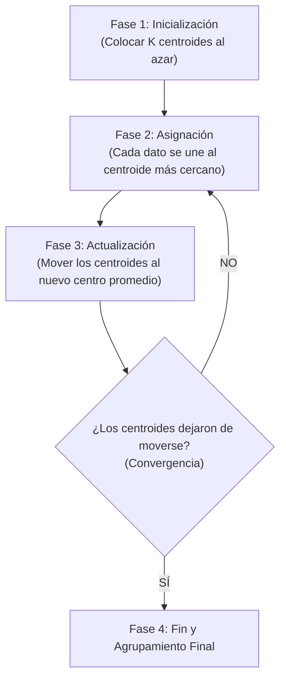

# 🔮 Explicación Didáctica: Algoritmo K-Means

Esta guía está diseñada para explicar de forma sencilla y visual a tus compañeros de clase cómo funciona el algoritmo **K-Means**, el principal modelo de agrupamiento (clustering) no supervisado de nuestro proyecto.

---

## 💡 1. ¿Qué es K-Means de manera intuitiva?

Imagina que entras a una biblioteca y hay miles de libros desordenados en el suelo. Tu objetivo es agruparlos en **$K$ montones** de manera que los libros del mismo montón se parezcan mucho entre sí (por ejemplo, por temática), y los montones sean lo más diferentes posible entre ellos.

En matemáticas, **K-Means** hace exactamente esto:
*   **"K"**: Es el número de grupos (montones) que nosotros, como analistas, le ordenamos al algoritmo encontrar (por ejemplo, $K = 3$).
*   **"Means" (Medias)**: Hace referencia a que el centro de cada grupo se calcula obteniendo el promedio matemático de todos los puntos que pertenecen a ese grupo.

---

## 📍 2. El concepto clave: El "Centroide"

Un **centroide** es el "representante" o el centro geométrico de un clúster. 
*   Si tuviéramos un grupo de personas y graficamos su edad y altura, el centroide sería un "punto imaginario" que representa la **edad promedio** y la **altura promedio** de ese grupo.
*   Cada clúster tiene **un único centroide**.

---

## 🔄 3. El Flujo de Funcionamiento Paso a Paso

El algoritmo funciona mediante un proceso repetitivo (iterativo) muy sencillo que consta de **4 fases**:



### 🏁 Paso 1: Inicialización (¿Dónde empezamos?)
*   El usuario define el valor de $K$ (por ejemplo, queremos 4 clústeres).
*   El algoritmo coloca aleatoriamente $K$ puntos en el espacio de datos. Estos puntos serán nuestros **centroides iniciales**.

### 📏 Paso 2: Asignación (¿A qué grupo pertenezco?)
*   Cada dato del dataset calcula su distancia a los $K$ centroides (usualmente usando la **Distancia Euclidiana**, es decir, una línea recta entre dos puntos).
*   Cada dato se asigna al clúster del **centroide que le quede más cerca**.

### 📐 Paso 3: Actualización (Recalcular el centro)
*   Una vez que todos los datos tienen un grupo asignado, los centroides viejos se borran.
*   Para cada grupo, se calcula el **promedio matemático** de las posiciones de todos los datos asignados a él.
*   El nuevo centroide se coloca exactamente en ese punto promedio (el centroide "se mueve" al centro real del grupo).

### 🔁 Paso 4: Convergencia (¿Cuándo paramos?)
*   Se vuelven a repetir los **Pasos 2 y 3**.
*   ¿Cuándo se detiene? Cuando al recalcular los promedios, los centroides **ya no se mueven** de lugar (o se mueven una cantidad infinitamente pequeña). En este momento decimos que el algoritmo **ha convergido** y los grupos son definitivos.

---

## 📈 4. ¿Cómo evaluamos si el agrupamiento es bueno?

En nuestra exposición, es clave explicar que K-Means no adivina, sino que mide la calidad usando matemáticas:

1.  **Inercia (Inertia)**: 
    *   Mide qué tan cerca está cada punto de su propio centroide. 
    *   **Meta**: Queremos una inercia **baja** (puntos muy pegados a su centro).
2.  **Coeficiente de Silueta (Silhouette Score)**:
    *   Mide qué tan bien separado está un grupo de otro. Evalúa si un punto está realmente cerca de su grupo (cohesión) y lejos del grupo vecino más cercano (separación).
    *   Va de **$-1$ a $1$**. Un valor cercano a $1$ significa que los clústeres están perfectamente separados y definidos.

---

## 💻 5. Implementación en Código (Scikit-Learn)

En Python, el entrenamiento de K-Means y la obtención de sus métricas se realiza de la siguiente manera utilizando la librería `scikit-learn`:

```python
from sklearn.cluster import KMeans
from sklearn.metrics import silhouette_score

def entrenar_kmeans(df_features, n_clusters=3):
    # Convertimos el DataFrame a matriz de numpy
    X = df_features.values
    
    # 1. Definir e instanciar el modelo
    # 'random_state=42' asegura que siempre devuelva los mismos resultados al ejecutarlo
    model = KMeans(n_clusters=n_clusters, random_state=42, n_init='auto')
    
    # 2. Entrenar y predecir los clústeres (Fases de Asignación y Actualización)
    labels = model.fit_predict(X)
    
    # 3. Extraer métricas de desempeño
    metrics = {
        "Inertia": float(model.inertia_),
        "Silhouette Score": float(silhouette_score(X, labels)) if len(set(labels)) > 1 else 0.0
    }
    
    return model, labels, metrics
```
